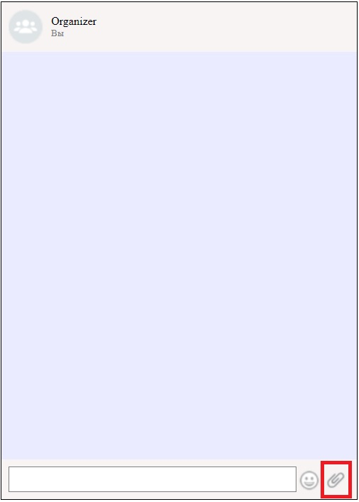
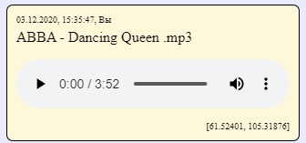

#Бот органайзер

***
##Обязательные функции:

<<<<<<< HEAD
- Сохранение в истории ссылок и текстовых сообщений

- Ссылки должны быть кликабельны и отображаться как ссылки

- Сохранение в истории изображений, видео и аудио - через Drag & Drop и через иконку загрузки 

Для того чтобы приложить медиа файл (изображение,аудио,видео), необходимо нажать на кнопку скрепки внизу формы органайзера

Выберите один или несколько файлов на компьютере и нажмите Открыть

Выбранные файлы отобразятся в ленте

Аналогично можно загружать аудио и видео

Также медиа-файлы можно перетащить в окно органайзера, в таком случае они появятся в ленте

- Скачивание файлов 

Скачать аудио:

Скачать видео:

Скачать картинку:

При наведении на изображение появляется кнопка, при клике на которую изображение скачивается.

- Ленивая подгрузка

При открытии страницы органайзера,а также если количество изображений в ленте больше 10, появляется кнопка "Еще 10", при нажатии на которую подгрузятся следующие 10 изображений истории

***
##Дополнительные функции:

- Отправка геолокации

Если в бразуере разрешена отправка геолокации, то в сообщениях при отправке будут переданы коородинаты
Если запрещена - будет написано "Местополжение неизвестно"

- Воспроизведение видео/аудио

- Установка напоминаний

Чтобы задать напоминание, необходимо отправить органайзеру команду вида
@schedule: 16:02 03.12.2020 "Текст напоминания"

Если напоминание успешно создано, он уведомит вас ответным сообщением

Если формат задания напоминания не совсем корректный, он ответит как нужно создавать напоминания

В назначенное время напоминание будет отображено пользователю в браузере как уведомление

Если уведомления отключены в браузере, то он предложит их активировать.
Если органайзер отключен в момент отправки напоминания, то пользователь получит его, когда подключится.

- Отправка команд боту

Бот может информировать вас о погоде, пробках, курсе валют, ценах на нефть и новым случаям заражения в вашем городе.
Используются следующие команды:

@weather - узнать прогноз погоды

@petrol - узнать о ценах на нефть

@currency - узнать курсы доллара и евро

@traffic - узнать о пробках

@corona - узнать о случаях заражения вирусом

- Поддержка смайликов (emoji)

Рядом со строкой ввода текста сообщения доступна кнопка вызова панели смайликов.
Кликните на любой смайлик чтобы добавить его к тексту сообщения

=======

>>>>>>> f9fb5f24ab15328d4b1ac6b5d19a3622bb5b34b2
